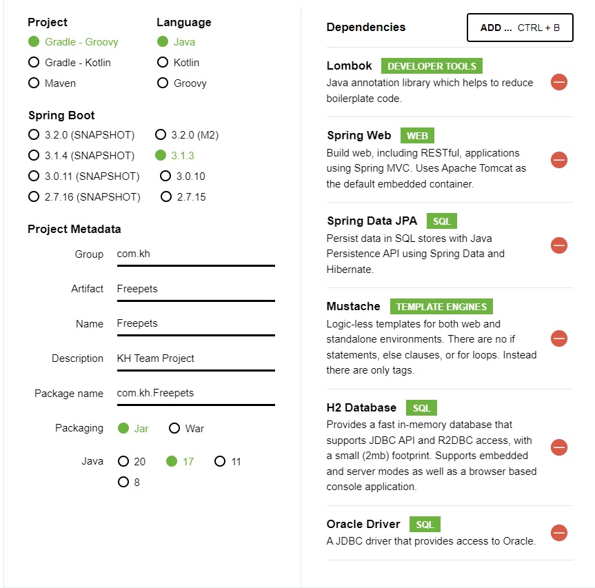

# 주간일지

## 9월

### 9월 2째 주

- 9월 7일

1. spring.io에서 boot setting 설정하기
2. 기존 만들었던 게시판별 MVC 폴더 생성 프로젝트 구조 잡기.

- 9월 8일 ~ 9월 17일 

1. MVC 구조 코드 작성시작 (폴더 이용해서 업무 분리)
2. Controller, Service, Repository, domain(vo,Entity) 클래스 생성 및 코드 작성

