# 주간일지

## 9월

### 9월 2째 주

- 9월 7일

1. spring.io에서 boot setting 설정하기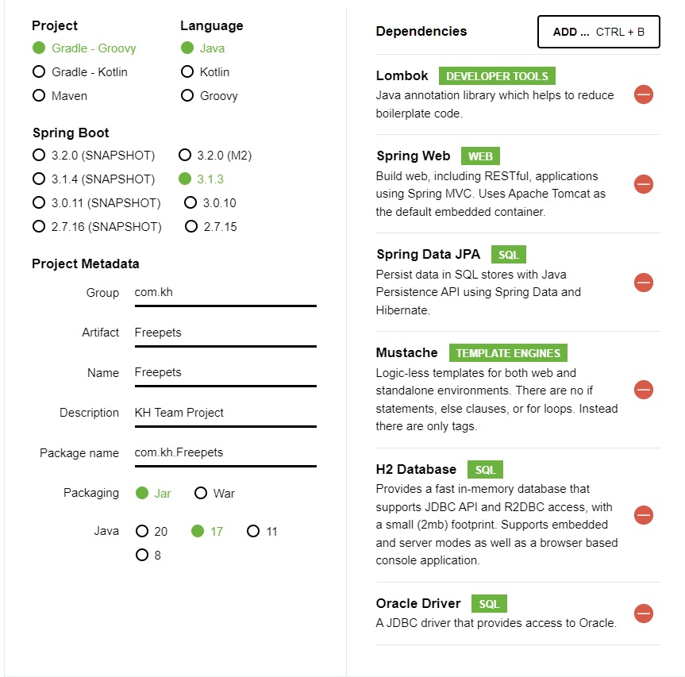
2. 기존 만들었던 게시판별 MVC 폴더 생성 프로젝트 구조 잡기.

### 9월 3째 주

- 9월 8일 ~ 9월 17일

1. MVC 구조 코드 작성시작 (폴더 이용해서 업무 분리)
2. Controller, Service, Repository, domain(vo,Entity) 클래스 생성 및 코드 작성

### 9월 4째 주

- 9월 18일 ~ 9월 22일

1. 각자 맡은 페이지 퍼블리싱 구조 잡기 + 되면 css까지.
    - 승환 : 공용게시판 구조, 마이페이지 설계
    - 지우 : 이미지 게시판 구조 설계
    - 도경 : 게시글 작성 페이지 설계
    - 예진 : 분실신고 게시글 상세 페이지 설계

**승환**
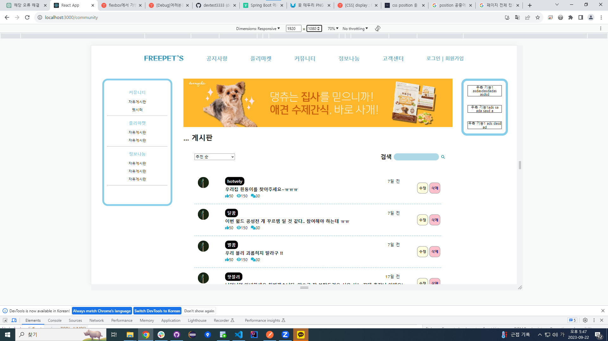

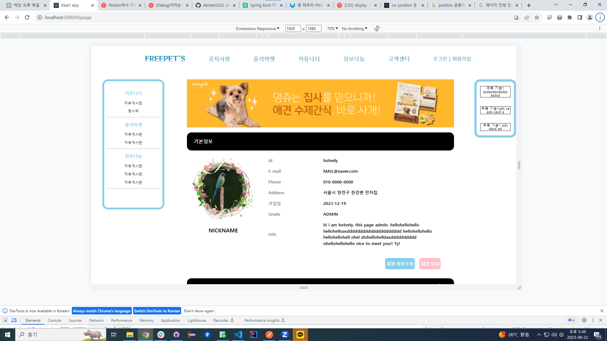
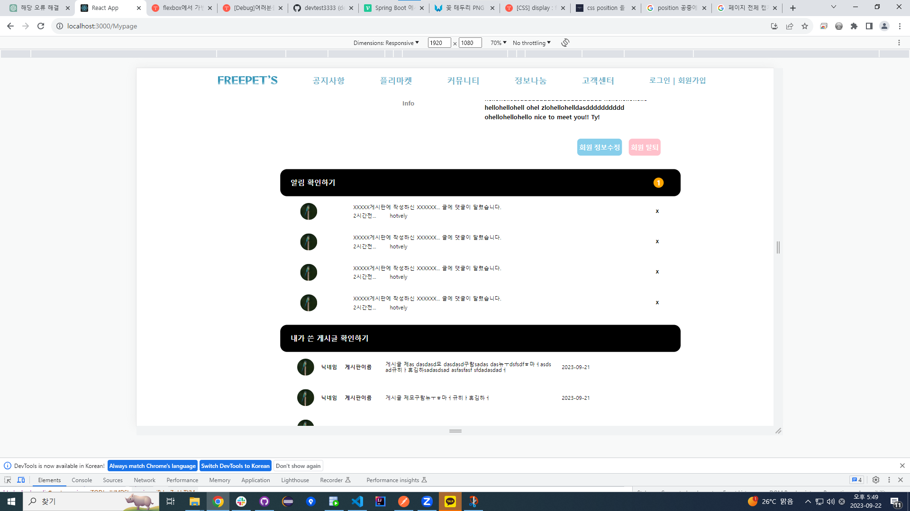
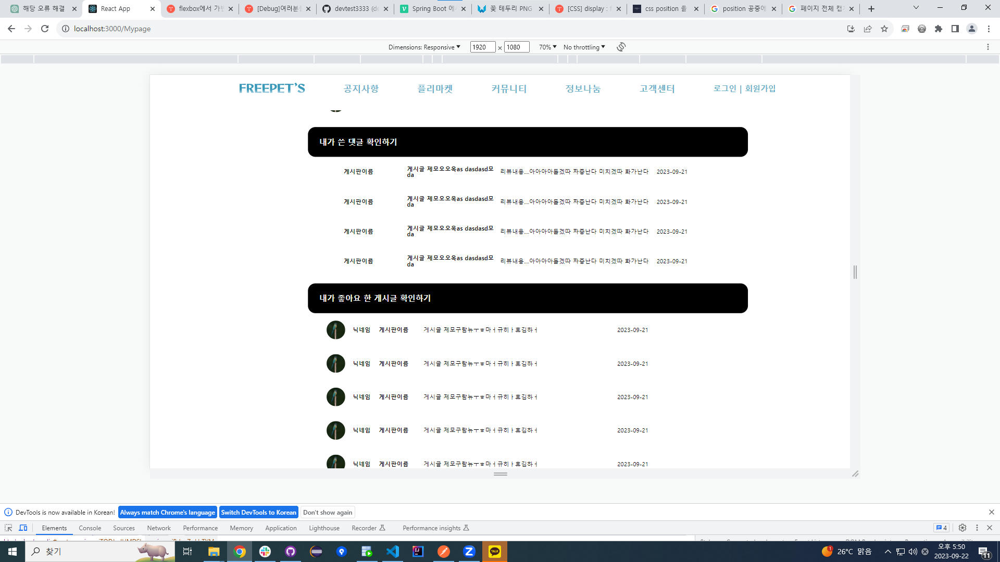

**지우**
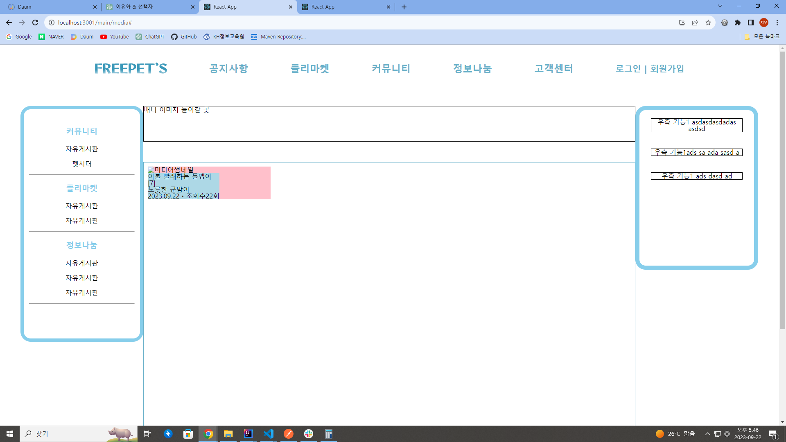

**도경**
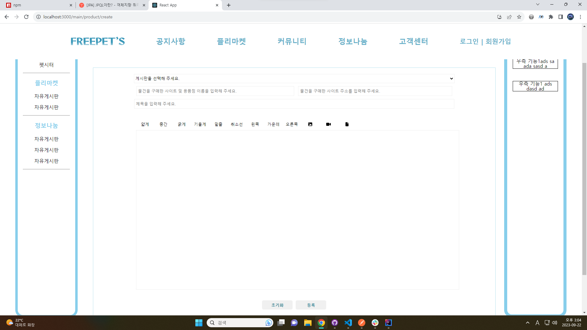

**예진**
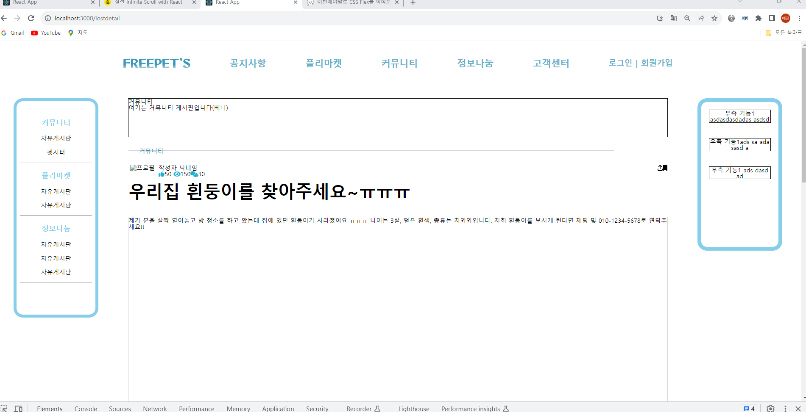

### 9월 5째 주 + 10월 1째 주

- 9/25 ~ 10/6

1. 백엔드
    - 파일 업로드 처리
    - 포스트맨 통합 테스트
    - 페이징처리
    - 정렬기능
2. 프론트

- css작업 (각자 맡은 퍼블리싱 페이지)

**승환**
✔️ 달력 기능 구현, 로그인페이지 구현
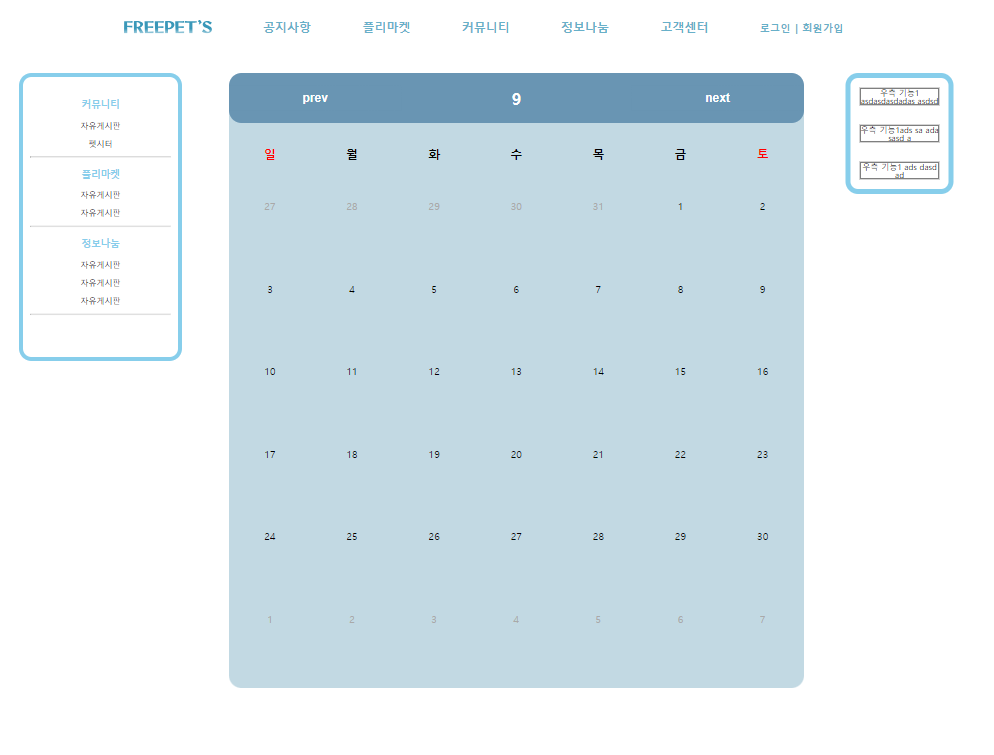

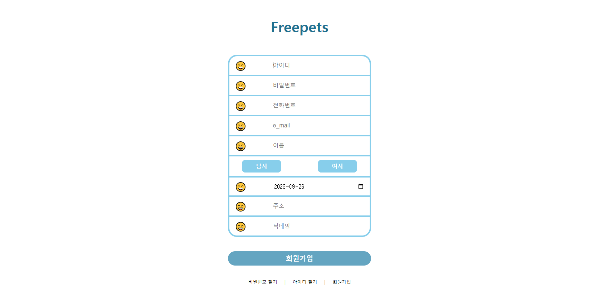

⚠️ 스프링 부트 시큐리티 멤버 관련 설정중
**지우**
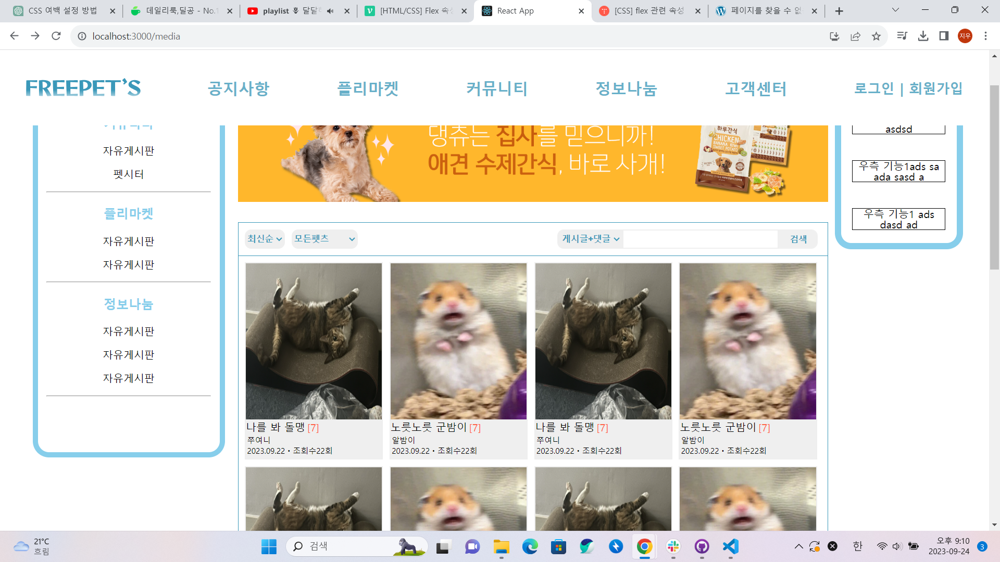
**도경**
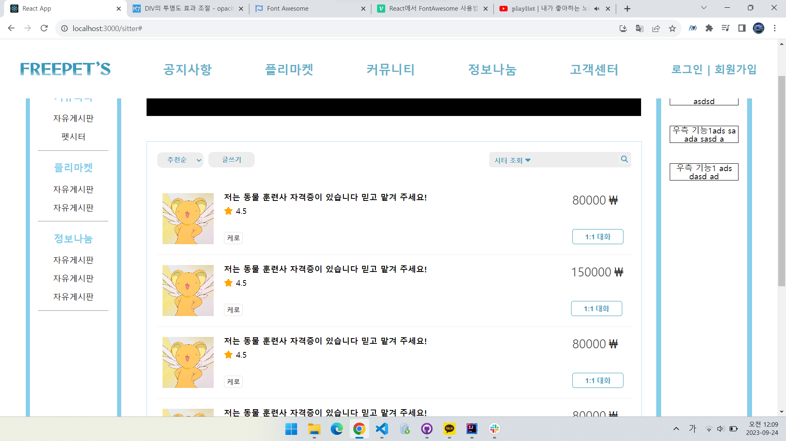
**예진**

- 10/7 - 10/8
  기존 작업 조정 및 오류 해결

### 10월 2째 주  : Front + back 연결 + css작업 (각자 맡은 퍼블리싱 페이지)

**승환**
✔️ 백엔드 :

1. user Security(비밀번호 암호화 등) + JWT TOKEN을 이용한 데이터 통신 처리

 ```java
 // 비밀번호 암호화 처리

import org.springframework.security.crypto.password.PasswordEncoder;

private final PasswordEncoder passwordEncoder=new BCryptPasswordEncoder();

//        Member member=Member.builder()
//        .id(dto.getId())
//        .password(passwordEncoder.encode(dto.getPassword()))      <- encode함수 이용해서 전달받은 비밀번호를 암호화 처리
 ```

2. 시큐리티를 사용함에 따라서 MemberController 에 유저 추가, 수정, 삭제, 아이디찾기,
   비밀번호 찾기(spring-boot-starter-mail 라이브러리를 통한 메일 전송) 기능 추가 및 수정

 ```java
    String token=tokenProvider.create(member);            // 직접 만든 TokenProvider 클래스를 이용해 token을 생성하고  
        MemberDTO responseDTO=memberService.createDTO(member,token);  // 프론트로 보낼 멤버관련 객체를 생성할 때 token과 객체를 주입하여 생성

        return ResponseEntity.ok().body(responseDTO); // 프론트로 response 처리
   ```

✔️ 프론트 :

1. 유저 관련 기능을 redux를 사용한 상태 관리를 위해 비동기 함수들에 기능 API(추가,수정,삭제,비밀번호찾기,아이디찾기)를 추가
   ```javascript
    const {함수명} = createAsyncThunk("userSlice/{함수명}", async (data) => {
        const response = await {함수명에 해당하는 API 호출}(data);
        return response.data;   
    });
    ```

2. Modal 라이브러리를 이용해 유저 정보 수정 기능을 컴포넌트 처리
   ```javascript

    ```

3. redux 를 사용한 비동기 처리를 위해 react hook(useEffect)를 이용해 데이터 페이징 처리를 시도함
   ```javascript

    ```

***----------------------------------- 로드맵 ----------------------------------***

## 해야 하는 퍼블리싱 페이지

1. 게시판틀(분실신고, 공지사항, 커뮤니티)
2. ✔️게시글 작성 페이지
3. ✔️️마이페이지, 관리자페이지
4. ✔️달력(이벤트 행사)
5. ✔️미디어게시판 (이미지 + 비디오)
6. ✔️맵들어갈 틀...게시판? (병원 정보만...)
7. ✔️펫시터 게시판
8. 채팅....
9. ✔️로그인페이지, ✔️회원가입, ✔️아이디,비밀번호 찾기

### 10월 3째 주

- 10/16 ~ 10/22

1. Front + back 연결 + css작업 (각자 맡은 퍼블리싱 페이지)
2. API 공공데이터 연결 + css

### 10월 4째 주

- 10/23 ~ 10/28

1. 트러블 슈팅(이슈 체킹)