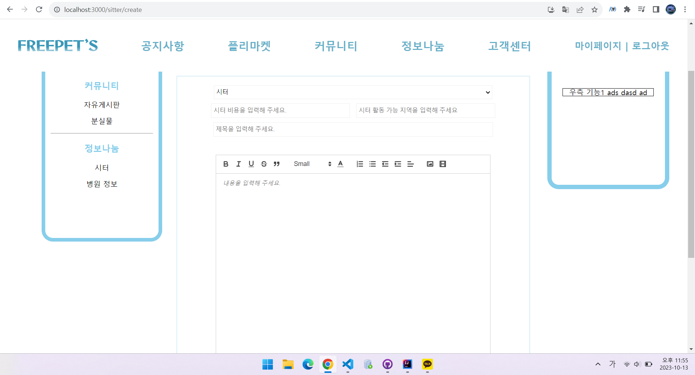

# 주간일지

## 9월

### 9월 2째 주

- 9월 7일

1. spring.io에서 boot setting 설정하기
2. 기존 만들었던 게시판별 MVC 폴더 생성 프로젝트 구조 잡기.

### 9월 3째 주

- 9월 8일 ~ 9월 17일

1. MVC 구조 코드 작성시작 (폴더 이용해서 업무 분리)
2. Controller, Service, Repository, domain(vo,Entity) 클래스 생성 및 코드 작성

### 9월 4째 주

- 9월 18일 ~ 9월 22일

1. 각자 맡은 페이지 퍼블리싱 구조 잡기 + 되면 css까지.
    - 승환 : 공용게시판 구조, 마이페이지 설계
    - 지우 : 이미지 게시판 구조 설계
    - 도경 : 게시글 작성 페이지 설계
    - 예진 : 분실신고 게시글 상세 페이지 설계

**승환**


**지우**


**도경**


**예진**


### 9월 5째 주 + 10월 1째 주

- 9/25 ~ 10/6

1. 백엔드
    - 파일 업로드 처리
    - 포스트맨 통합 테스트
    - 페이징처리
    - 정렬기능
2. 프론트

- css작업 (각자 맡은 퍼블리싱 페이지)

**승환**
✔️ 달력 기능 구현, 로그인페이지 구현


⚠️ 스프링 부트 시큐리티 멤버 관련 설정중
**지우**


**도경**
✔️ 게시글 작성 페이지 수정, 시터 게시판 구현


**예진**

- 10/7 - 10/8
  기존 작업 조정 및 오류 해결

### 10월 2째 주  : Front + back 연결 + css작업 (각자 맡은 퍼블리싱 페이지)

**승환**
✔️ 백엔드 :

1. user Security(비밀번호 암호화 등) + JWT TOKEN을 이용한 데이터 통신 처리

   ```java
    // 비밀번호 암호화 처리
   
   import org.springframework.security.crypto.password.PasswordEncoder;
   
   private final PasswordEncoder passwordEncoder=new BCryptPasswordEncoder();
   
   //        Member member=Member.builder()
   //        .id(dto.getId())
   //        .password(passwordEncoder.encode(dto.getPassword()))      <- encode함수 이용해서 전달받은 비밀번호를 암호화 처리
   ```

2. 시큐리티를 사용함에 따라서 MemberController 에 유저 추가, 수정, 삭제, 아이디찾기,
   비밀번호 찾기(spring-boot-starter-mail 라이브러리를 통한 메일 전송) 기능 추가 및 수정

   ```java
    String token=tokenProvider.create(member);            // 직접 만든 TokenProvider 클래스를 이용해 token을 생성하고  
        MemberDTO responseDTO=memberService.createDTO(member,token);  // 프론트로 보낼 멤버관련 객체를 생성할 때 token과 객체를 주입하여 생성

        return ResponseEntity.ok().body(responseDTO); // 프론트로 response 처리
   ```

3. 유저 관련 기능을 redux를 사용한 상태 관리를 위해 비동기 함수들에 기능 API(추가,수정,삭제,비밀번호찾기,아이디찾기)를 추가
   ```javascript
    const {함수명} = createAsyncThunk("userSlice/{함수명}", async (data) => {
        const response = await {함수명에 해당하는 API 호출}(data);
        return response.data;   
    });
    ```

4. Modal 라이브러리를 이용해 유저 정보 수정 기능을 컴포넌트 처리
   ```javascript
   // MemberUpdate 컴포넌트가 적용될 컴포넌트에서 필요한 매개변수 받기
   const MemberUpdate = (isOpen, setIsOpen, user, dispatch) => {

   const openModalHandler = () => {
   setIsOpen(!isOpen);
   };
   
   const formDataHandler = (e) => {
   e.preventDefault();
    const formData = {
      //서버로 보낼 데이터 연결...
    };
    //... 데이터 전송 관련 체크 기능    
    return false;
   };
   
   return (
   <> 
      <div
        onClick={(e) => {
          if (e.target.className.includes("Overlay")) openModalHandler();
        }}
      >
        <Modal isOpen={isOpen} style={customModalStyled} ariaHideApp={false}>
          <FormInput>
               //유저에게 데이터 받는 기능...
          </FormInput>
        </Modal>
      </div>
    </>

   );
   };

   ```

5. redux 를 사용한 비동기 처리를 위해 react hook(useEffect)를 이용해 데이터 페이징 처리를 시도함
   ```javascript

   useEffect(() => {

    if (user === null && !localStorage.getItem("user")) {
      alert("존재하지 않는 유저입니다.");
      dispatch(userReset());
      return navigate("/auth/login");
    }
    if (user !== null && Object.keys(user).length !== 0) {
      if (user.deleteAccountYN === "Y" && !localStorage.getItem("user")) {
        alert("이미 탈퇴한 회원");
        return navigate("/auth/login");
      }
      if (user.deleteAccountYN === "N" && localStorage.getItem("user")) {
        alert("로그인 성공!");
        return navigate("/main");
      }
    }

   }, [user]);

   ```

**지우**

✔️ 프론트 :

1. 페이지 이동 함수 추가
2. 미디어 보기 타입 (서버 연결 했지만 데이터가 들어가지 않음 )
   (-> 추후 작업 예정 : 오류 수정, 데이터 전송, 일반페이지 글쓰기, 목록보기, 페이지css수정)

✔️ 백엔드 :

1. 파일 업로드 기능수정
2. 좋아요 기능 및 정렬 기능 추가,수정 완료
3. 커뮤니티, 커뮤니티 댓글 컨트롤러 체크 완료
   ( -> 로스트(일반게시판) 컨트롤러로 통합 예정)

**도경**

- 백엔드 ✔️

1. 이미지, 비디오 등 file 관련 처리 메소드, api 생성

```java
@Value("${freepets.upload.path}")
private String uploadPath;

public String fileInput(MultipartFile file){
        String originalFile=file.getOriginalFilename();
        String realFile=originalFile.substring(originalFile.lastIndexOf("\\")+1);
        String uuid=UUID.randomUUID().toString();
        String saveFile=uploadPath+File.separator+uuid+"_"+realFile;
        Path pathFile=Paths.get(saveFile);

        try{
        file.transferTo(pathFile);
        }catch(IOException e){
        throw new RuntimeException(e);
        }
        return uuid+"_"+realFile;
        }
```

```java
@PostMapping("/img")
public ResponseEntity<FileDataDTO> imgReturn(@RequestParam(name = "file", required = true) MultipartFile file){
        String originalFile=file.getOriginalFilename();
        String realFile=originalFile.substring(originalFile.lastIndexOf("\\")+1);
        String uuid=UUID.randomUUID().toString();
        String saveFile=uploadPath+File.separator+uuid+"_"+realFile;
        Path pathFile=Paths.get(saveFile);
        try{
        FileDataDTO fileDataDTO=new FileDataDTO();
        file.transferTo(pathFile);
        fileDataDTO.setTitle(realFile);
        fileDataDTO.setUrl("http://localhost:3000/upload/"+uuid+"_"+realFile);
        return ResponseEntity.status(HttpStatus.OK).body(fileDataDTO);
        }catch(IOException e){
        throw new RuntimeException(e);
        }
        }
```

2. QueryDSL 설정 후 일부 기능 querydsl 방식으로 전환

```java
@Autowired(required = true)
private JPAQueryFactory queryFactory;

private final QSitterReview qSitterReview=QSitterReview.sitterReview;
private final QSitter qSitter=QSitter.sitter;

public List<SitterReview> showall(String id){
        return queryFactory.selectFrom(qSitterReview)
        .join(qSitterReview.sitter,qSitter)
        .where(qSitter.member.id.eq(id))
        .fetch();
        }
```

- 프론트 ✔️

1. Modal 라이브러리 사용해 1:1 채팅 팝업

```javascript

    const handleModalClick = (e) => {
        e.preventDefault();
        e.stopPropagation();
    }

    const chattingClick = (e) => {
        e.preventDefault();
        e.stopPropagation();
        setModalCheck(true);
    };

    const handleModalClose = () => {
        setModalCheck(false);
    };

     const ModalStyle = {
        content: {
            top: '20vh',
            left: '15vw',
            bottom: '15vh',
            right: '15vw',
        }
    };

return (
   <div className="main-content_end">
    <p><span id="sitterPrice">{items.sitterPrice}</span>₩</p>
      <div onClick={handleModalClick}>
      <button onClick={chattingClick}>1:1 대화</button>
      <Modal isOpen={modalCheck}  ariaHideApp={false} onRequestClose={handleModalClose} style={ModalStyle}>                                           
      <Chatting/>
      </Modal>
    </div>
)
```

2. 게시글 작성 컴포넌트를 생성하여 useState로 데이터를 관리하고 axios 비동기 처리 방식으로 데이터 넘기기, react-Quill 라이브러리 사용하여 글쓰기 쪽 image 관리

```javascript
<div className="main-content">
  <ReactQuill
    ref={quillRef}
    style={{"width" : "100%", "height" : "500px"}} 
    modules={modules} 
    theme="snow"
    onChange={InputDescHandler}
    placeholder="내용을 입력해 주세요."/>
</div>
```

### 10월 3째 주 ~ 10월 4째 주

- 10/16 ~ 10/22

1. ✔️Front + back 연결 + css작업 (각자 맡은 퍼블리싱 페이지)

- 10/23 ~ 10/28

1. 트러블 슈팅(이슈 체킹) -> 11월 1째 주 이관.. (기본적인 테스팅은 진행완료)
2. 필요한 API 이식 및 본인 맡은 페이지 기능 처리 (진행중..)

**승환**

1. 날씨 Open Weather API + Naver maps API 이식후 날씨 정보, 현재 위치 가져오는 기능 추가 완료
2. 회원가입 폼 (주소찾기 API 추가 및 정규식 처리) , 아이디 비밀번호 찾기 폼 변경
3. 공지사항 게시판 불완전한 페이징 처리 및 정렬 기능 완료
4. 댓글 컴포넌트 특정 컨트롤러 API 호출하는 부분 밖으로 분리 하여 통합 관리 변경
5. 새로고침 시에 API 인식 못하던 부분 변경 완료
6. 특정 게시판 (공지사항, 이벤트 캘린더) 글쓰기 수정 삭제 권한으로 조건 처리 완료
7. 페이징 css 창 줄이면 특정 px까지만 줄고 그이상 줄어들지 않도록 flex-shrink 처리 완료
8. 유저 자동 로그 아웃 시키기 위해서 cookie이용해서 처리 완료 데이터는 쿠키에 담지 않음
9. 다른 유저 페이지 추가해서 기본적인 정보만 출력하도록 추가 완료
10. 유저 관련 알림 처리 추가 완료 (다른사람이 댓글 대댓글 달게 되면 알림)
11. 북마크 기능 추가 완료
12. 공지사항 게시글 내부 비동기 데이터 처리 완료 및 좋아요 등 기능 추가 완료

**도경**

1. 주소 받아서 MAP API 연결 후 화면에 구현 기능 추가
2. 채팅 Modal 라이브러리에서 새 창 띄우는 방식으로 변경
3. 별점 관련해서 update 값이 0 대신 NaN으로 들어가는 부분 오류 수정
4. 게시판 글쓰기, 수정, 삭제 권한 수정
5. 날짜 포매팅 함수 생성
6. 이미지 썸네일 이미지 태그 중 제일 첫 번째 사진이 나오게 데이터 처리
7. 채팅(쪽지) save 하고 바로 값 안 들어오는 부분 API 하나 더 생성해서 해결
8. 통합 검색 기능 추가 완료
9. 좋아요 API 한 개로 관리할 수 있도록 메소드 수정
10. 페이징 처리 관련 도메인 생성 후 pageable과 연결, 컴포넌트 생성

### 11월 1째 주

1. 트러블 슈팅(11월 2일 or 3일 예정) -> 지우님 게시판 추가 완료 후 체킹 예정
2.

***----------------------------------- 로드맵 ----------------------------------***

## 해야 하는 퍼블리싱 페이지

1. 게시판틀(분실신고, 공지사항, 커뮤니티)
2. ✔️게시글 작성 페이지
3. ✔️️마이페이지, 관리자페이지
4. ✔️달력(이벤트 행사)
5. ✔️미디어게시판 (이미지 + 비디오)
6. ✔️맵들어갈 틀...게시판? (병원 정보만...)
7. ✔️펫시터 게시판
8. 채팅....
9. ✔️로그인페이지, ✔️회원가입, ✔️아이디,비밀번호 찾기

### 10월 3째 주

- 10/16 ~ 10/22

1. ✔️Front + back 연결 + css작업 (각자 맡은 퍼블리싱 페이지)

### 10월 4째 주

- 10/23 ~ 10/28

1. 트러블 슈팅(이슈 체킹) -> 11월 1째 주 이관..
2. 필요한 API 이식 및 본인 맡은 페이지 기능 처리

##                  